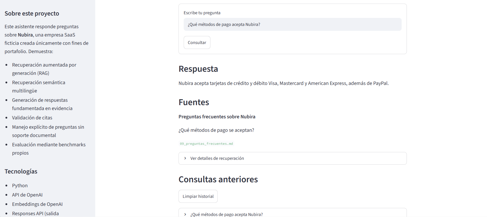
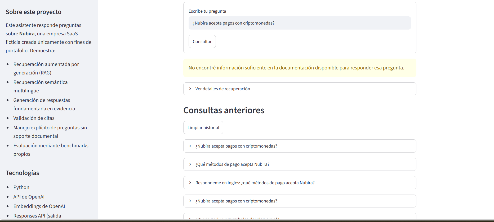
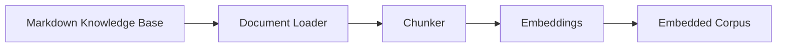

# RAG Knowledge Agent

A Spanish-first Retrieval-Augmented Generation assistant that answers questions
about **Nubira**, a fictional SaaS company, using only its internal Markdown
documentation. It combines semantic retrieval, grounded structured generation,
Python-validated citations, and an explicit "insufficient information"
fallback for questions the documentation doesn't cover — backed by two
transparent, rule-based evaluation benchmarks and a Streamlit interface.

## Demo

**Live Demo:**
https://ulises-rag-knowledge-agent.streamlit.app/

The app is deployed on Streamlit Community Cloud and can also be run locally:

```powershell
streamlit run streamlit_app.py
```

## Screenshots

**Supported question** — the assistant answers from retrieved evidence and
shows a validated citation back to the source document:



**Unsupported question** — a cryptocurrency question retrieves related
payment-method evidence, but the system correctly refuses to answer instead of
guessing, because that evidence never actually addresses cryptocurrency:



## Problem

Internal documentation is often spread across many separate documents —
pricing, billing, refund policy, account management, support procedures. A
naive LLM asked a question about that domain will often produce a fluent,
plausible-sounding answer even when the documentation says nothing about the
topic, because it falls back on general world knowledge instead of admitting
it doesn't know. That failure mode — hallucination — is the core problem this
project is designed to demonstrate a mitigation for.

## Solution

The project takes a deliberately controlled approach:

1. Load a fixed set of internal Markdown documents.
2. Split them into deterministic, section-aware chunks.
3. Embed each chunk with a multilingual embedding model.
4. Retrieve the top-K most semantically similar chunks for a question.
5. Generate an answer using **only** that retrieved evidence — never external
   knowledge.
6. Validate the model's cited evidence IDs in Python before trusting them.
7. Return a controlled, deterministic fallback message when the evidence is
   insufficient, instead of letting the model guess.

## Architecture

Offline corpus preparation (run once per process, cached):



Runtime question-answering path:

```mermaid
flowchart LR
    Q[User Question] --> UI[Streamlit]
    UI --> AGENT[RAGAgent]
    AGENT --> RET[SemanticRetriever]
    RET --> QE[Query Embedding]
    QE --> COS[Cosine Similarity]
    COS --> TOPK[Top-K Evidence]
    TOPK --> GEN[Grounded Generator]
    GEN --> SO[Structured Output]
    SO --> VAL[Python Grounding Validation]
    VAL --> ANS[Answer + Real Citations]
```



The `RAGAgent`'s `SemanticRetriever` searches the same `Embedded Corpus` built
by the offline pipeline above; it is built once per process and reused for
every question.

## Knowledge Base

The knowledge base consists of **9 fictional Spanish Markdown documents**
covering: product overview, pricing and plans, billing and payments,
cancellations and refunds, accounts and access, security and privacy,
support, troubleshooting, and FAQ. **Nubira is entirely fictional** — the
company, its policies, prices, and procedures were invented specifically for
this project. No real, confidential, or copyrighted company documentation is
used anywhere in this repository.

## RAG Pipeline

1. **Document loading** (`rag/document_loader.py`) — reads the Markdown files
   and extracts each document's title, preserving UTF-8/Spanish characters.
2. **Markdown-aware chunking** (`rag/chunker.py`) — deterministically splits
   each document along its heading structure, keeping source/section metadata
   attached to every chunk.
3. **Embedding generation** (`rag/embeddings.py`) — embeds each chunk with the
   OpenAI Embeddings API behind a single service class.
4. **Cosine-similarity retrieval** (`rag/retriever.py`) — embeds the incoming
   question and ranks the corpus by cosine similarity, returning the top-K
   chunks.
5. **Grounded answer generation** (`agent/rag_agent.py`) — sends the question
   and the retrieved evidence (only) to the OpenAI Responses API, requesting
   structured output that includes an answerability decision and the
   supporting evidence IDs.
6. **Citation validation** — the model's evidence IDs are checked in Python
   against the actual retrieved chunks before being trusted or shown.
7. **Unsupported-question fallback** — if the evidence is insufficient, a
   single deterministic Spanish message is returned instead of any
   model-generated text.

## Grounding and Hallucination Control

- Generation uses **only** the evidence retrieved for that specific question —
  never external/world knowledge.
- A high similarity score is **not** treated as proof that the documentation
  actually answers the question (this is demonstrated directly in the
  unsupported-question screenshot above).
- Whether a question is answerable is decided from the evidence itself, not
  from a similarity threshold.
- Unsupported questions receive a fixed, deterministic fallback message —
  never a model-improvised refusal.
- Evidence IDs returned by the model are validated in Python: unknown,
  duplicate, or logically inconsistent IDs are rejected rather than silently
  repaired.
- User-facing citations are built only from the real, retrieved chunk
  metadata — the model is never trusted to supply a citation directly.
- The generation prompt enforces a **minimal sufficient evidence** principle,
  so the model is instructed to cite only what's actually necessary to
  support the answer, reducing irrelevant or merely-related citations.

This project does **not** claim zero hallucinations. It demonstrates a set of
concrete, testable safeguards that measurably reduce — but do not provably
eliminate — hallucination risk.

## Evaluation

Evaluation is **rule-based and transparent** — there is no LLM-as-a-judge and
no learned quality score. Both benchmarks below share the same 20
hand-curated questions.

### Retrieval Evaluation

Measures whether semantic retrieval finds the right evidence:

- 16 curated answerable queries
- 4 unsupported diagnostic queries
- Hit@1: 100%
- Hit@3: 100%
- MRR@5: 1.00

Unsupported questions are intentionally undocumented topics (e.g.
cryptocurrency payments); they are diagnostic only and excluded from the
retrieval relevance metrics above, since there is no correct chunk for
retrieval to find.

### Grounded Answer Evaluation

Measures the *final* answer — not just retrieval — via accent/case-insensitive
factual-content checks, citation validation against vetted evidence targets,
and exact-match checking of the controlled refusal message:

- 20 curated cases total (16 answerable + 4 unsupported)
- Answerability accuracy: 100%
- Fact-check pass rate: 100%
- Citation-check pass rate: 100%
- Unsupported refusal rate: 100%
- Overall pass rate: 100%

**These results apply only to the curated benchmark included in this
repository and are not claims of general model accuracy.**

## Test Coverage

**304 tests passing**, using `pytest` with mocked/injected clients — no real
OpenAI API calls are made during the test suite. Covered areas include:

- document loading and UTF-8/Spanish-character handling
- deterministic chunking and metadata preservation
- embedding service interfaces
- cosine-similarity retrieval and ranking
- grounded-generation and citation validation logic
- unsupported-question fallback behavior
- both evaluation frameworks (retrieval and grounded-answer)
- Streamlit presentation helpers

## Observability

The Streamlit interface exposes an expandable "Ver detalles de recuperación"
panel showing, for each retrieved chunk:

- source document
- section
- semantic similarity score
- a short text preview

Similarity is explicitly labeled as **semantic similarity, not confidence** —
a high score means the retrieved text is topically close to the question, not
that it necessarily answers it. No chain-of-thought or hidden model reasoning
is ever exposed.

## Tech Stack

- Python 3.13+
- OpenAI API
- OpenAI Embeddings
- OpenAI Responses API (structured output)
- Pydantic
- Streamlit
- pytest
- Markdown
- Git / GitHub

## Project Structure

```
rag-knowledge-agent/
├── app.py                    # Placeholder CLI entry point (separate from the Streamlit UI)
├── streamlit_app.py          # Spanish-first Streamlit UI around the public RAGAgent
├── rag/
│   ├── document_loader.py    # Loads Markdown files into KnowledgeDocument objects
│   ├── chunker.py            # Splits documents into section-aware KnowledgeChunk objects
│   ├── embeddings.py         # Embeds chunks via the OpenAI Embeddings API
│   └── retriever.py          # Cosine-similarity SemanticRetriever
├── agent/
│   └── rag_agent.py          # RAGAgent + OpenAIGroundedGenerator: grounded generation & citations
├── knowledge/                 # 9 fictional Spanish Markdown documents
├── evals/
│   ├── retrieval_cases.py    # Curated retrieval evaluation dataset
│   ├── retrieval_metrics.py  # Hit@K / MRR pure functions
│   ├── retrieval_runner.py   # Runs retrieval cases, aggregates metrics
│   ├── run_retrieval_evals.py # CLI: python -m evals.run_retrieval_evals
│   ├── answer_cases.py       # Same 20 questions + required facts + acceptable citations
│   ├── answer_checks.py      # normalize_text / fact / citation rule-based checks
│   ├── answer_runner.py      # Runs answer cases against a RAGAgent, aggregates metrics
│   └── run_answer_evals.py   # CLI: python -m evals.run_answer_evals
├── tests/                     # pytest suite (no real OpenAI calls)
├── docs/
│   └── screenshots/           # README screenshots
├── .streamlit/
│   └── config.toml            # Small non-secret Streamlit config (e.g. disables usage-stats prompt)
├── CLAUDE.md                 # Project/AI-assistant working instructions
├── .env.example
├── .gitignore
├── requirements.txt
└── README.md
```

## Getting Started

```powershell
git clone https://github.com/fernandezulises66-svg/rag-knowledge-agent.git
cd rag-knowledge-agent
python -m venv .venv
.venv\Scripts\Activate.ps1
pip install -r requirements.txt
Copy-Item .env.example .env
```

Then edit `.env` with your own OpenAI API key and, if you want to override
the defaults, model names:

```
OPENAI_API_KEY=your_api_key
OPENAI_MODEL=gpt-5.6-luna
OPENAI_EMBEDDING_MODEL=text-embedding-3-small
```

## Running the UI

```powershell
streamlit run streamlit_app.py
```

On first run, the app builds and embeds the knowledge base once (one real
OpenAI embeddings request for the whole corpus) and caches the resulting
pipeline via `st.cache_resource`, so it isn't rebuilt on every rerun.

## Running Tests

```powershell
pytest -q
```

`pytest` never makes a real API call — every test uses a fake or injected
client.

## Running Evaluations

```powershell
python -m evals.run_retrieval_evals
python -m evals.run_answer_evals
```

Unlike `pytest`, these two commands make **real** OpenAI API calls (and so
consume real API usage) — run them deliberately, not as part of routine
testing.

## Example Questions

- ¿Cuánto cuesta el plan Inicial?
- ¿Qué métodos de pago acepta Nubira?
- ¿Puedo pedir un reembolso del plan anual?
- ¿Cuánto dura un enlace para restablecer la contraseña?
- ¿Nubira acepta pagos con criptomonedas?
- Respondeme en inglés: ¿qué métodos de pago acepta Nubira?

The cryptocurrency example is intentional: it demonstrates the
insufficient-information fallback even though retrieval returns related
payment-method evidence (see the unsupported-answer screenshot above).

## Security / Secrets

- API keys are read from environment variables, never hardcoded.
- `.env` is gitignored and must never be committed.
- `.env.example` contains only placeholder values and default model names —
  no real credentials.
- `.streamlit/secrets.toml`, if ever created locally, is also gitignored and
  must never contain committed credentials.
- The deployed app's API key and model names are configured as Streamlit
  Community Cloud secrets, set directly in the platform's dashboard — never
  committed to GitHub.
- No confidential or real-company documentation is used anywhere in this
  repository; the entire knowledge base is fictional.

## Limitations

- Embeddings are held in memory only; there is no persistent vector database.
- The knowledge-base corpus is small and static (9 documents).
- No conversational memory — each question is answered independently.
- No hybrid (keyword + semantic) retrieval and no reranking.
- No authentication or rate limiting.
- The curated evaluation set (20 questions) is intentionally small.
- This is a portfolio project, not a production-ready system.

## Future Improvements

- Persistent vector storage for a larger, growing corpus.
- Larger and more diverse document collections.
- Retrieval/reranking experiments to compare against the current baseline.
- An expanded evaluation dataset with more edge cases.
- Authentication and rate limiting for a public deployment.
- Production-grade observability (latency, cost, and error tracking).

## Deployment

This project is deployed on **Streamlit Community Cloud**.

- **Platform:** Streamlit Community Cloud
- **Status:** deployed
- **Entry point:** `streamlit_app.py`
- **Public URL:** https://ulises-rag-knowledge-agent.streamlit.app/
- **Required Streamlit secrets** (set in the platform's dashboard, never
  committed to GitHub):

  ```toml
  OPENAI_API_KEY = "..."
  OPENAI_MODEL = "gpt-5.6-luna"
  OPENAI_EMBEDDING_MODEL = "text-embedding-3-small"
  ```

On startup, the deployed app builds and embeds the knowledge base once (via
the same cached `build_rag_agent()` used locally) and reuses that corpus for
every subsequent question in that process. The real OpenAI API key is never
placed in this README or in any committed file.

## Language

- The user-facing application, the knowledge base, and agent answers are
  **Spanish-first**; the assistant understands English questions too and will
  answer in English only when explicitly asked.
- All code, comments, docstrings, and this README remain in **English**.
